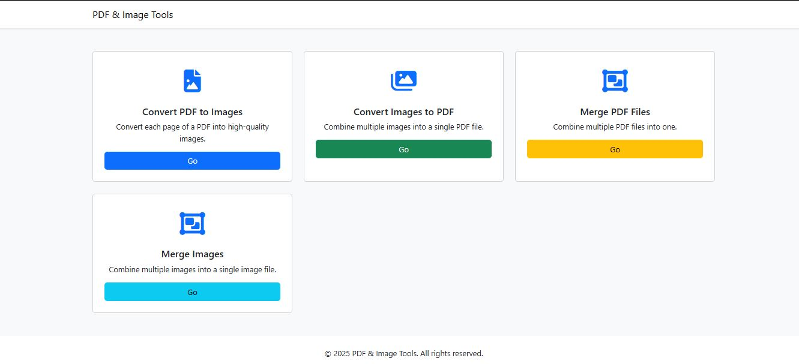
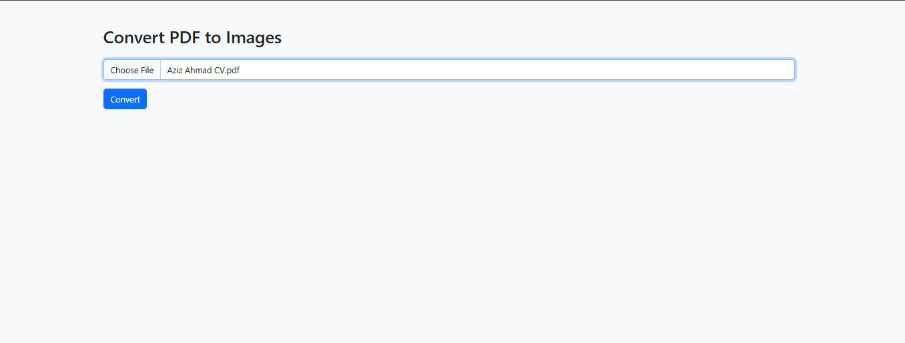

# 📄 PDF & Image Tools

A powerful and user-friendly web application built with **Flask** that allows you to manipulate PDF and image files seamlessly.


---

## 🚀 Features

- ✅ **Convert PDF to Images**  
  Converts every page of a PDF into a separate image and compresses them in a downloadable ZIP.

- ✅ **Convert Images to PDF**  
  Combine multiple images into a single high-quality PDF.

- ✅ **Merge PDF Files**  
  Combine multiple PDFs into one document.

- ✅ **Merge Images Vertically**  
  Stack multiple images into one continuous image for smooth scrolling or printing.

---

## 🛠 Technologies Used

- 🐍 Python 3  
- 🌐 Flask  
- 📦 PyMuPDF (`fitz`) – for PDF to Image conversion  
- 📄 PyPDF2 – for PDF merging  
- 🖼 Pillow – for image processing  
- 🎨 Bootstrap 5 – for responsive UI  
- 💅 Font Awesome – for icons

---

## 🧑‍💻 Setup Instructions

1. **Clone the repository**
   ```bash
   git clone https://github.com/azizahmad7751/PDF-Image-Tools.git
   cd PDF-Image-Tools
   ```

2. **Create a virtual environment**
   ```bash
   python -m venv venv
   ```

3. **Activate the virtual environment**

   - On macOS/Linux:
     ```bash
     source venv/bin/activate
     ```

   - On Windows:
     ```bash
     venv\Scripts\activate
     ```

4. **Install dependencies**
   ```bash
   pip install -r requirements.txt
   ```

5. **Run the application**
   ```bash
   python app.py
   ```

6. **Open the app in your browser**  
   Navigate to: [http://127.0.0.1:5000/](http://127.0.0.1:5000/)

---

## 📸 Screenshots


Here is what the interface looks like:





---

## 📦 Roadmap

- [x] Flask backend with 4 tools
- [x] Clean Bootstrap 5 interface
- [x] Download functionality (ZIP/PDF)
- [ ] Drag & Drop file upload
- [ ] Add tooltips + accessibility features
- [ ] Docker deployment support
- [ ] Multi-language interface (i18n)

---

## 🤝 Contributing

Contributions are welcome! If you'd like to contribute:

1. Fork the repository  
2. Create a new branch:
   ```bash
   git checkout -b feature/tool-name
   ```
3. Commit your changes:
   ```bash
   git commit -m 'Add new feature'
   ```
4. Push to the branch:
   ```bash
   git push origin feature/tool-name
   ```
5. Open a pull request

---

## 📄 License

This project is licensed under the MIT License – see the [LICENSE](LICENSE) file for details.

---

## 👨‍💻 Author

**Aziz Ahmad**  
🌐 [GitHub Profile](https://github.com/azizahmad7751)  
📧 engr.azizahmad7751@gmail.com
🔗 [linkden Profile](https://www.linkedin.com/in/theazizahmad/)  

> Built with ❤️ using Flask, Bootstrap, and a passion for clean tools.
